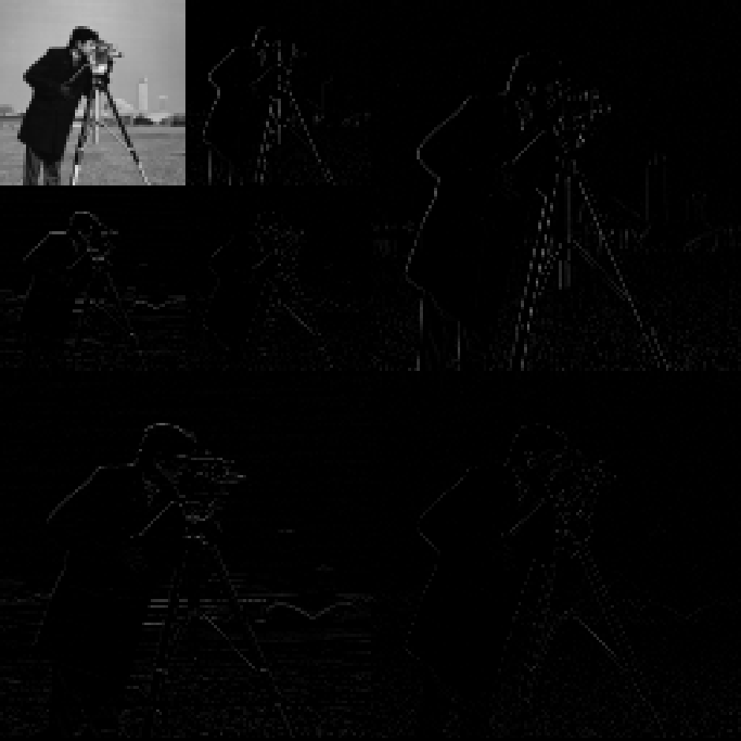

# Wavelet transformation 

This project contains C++ implementation of 2D wavelet transformation. Haar wavelet function is used.

## functions:
* wavelet_transfrom_1D
* wavelet_transform_2D
* inverse_wavelet_transfrom_1D
* inverse_wavelet_transform_2D

## Library requirements:
* cmake
* opencv

## How to run the code  
In the project directory, use below commands to run the project.

```bash
mkdir build
cd build
cmake ..
make
./bin/Wavelets
```

## Original image


## Wavelet transformation (level 2)


## Contributers
Bhagath Mamidlapelly (127068)
Abinav Sajeev (127009)
